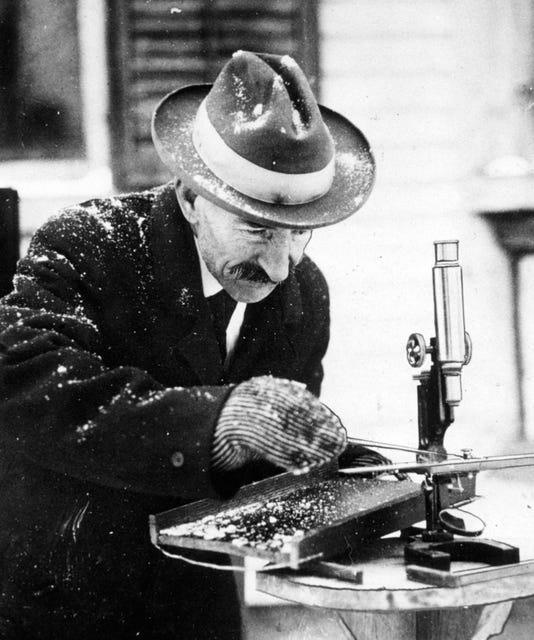

---

Learn more about GitLab Pages at https://pages.gitlab.io and the official
documentation https://docs.gitlab.com/ce/user/project/pages/.

---

<!-- START doctoc generated TOC please keep comment here to allow auto update -->
<!-- DON'T EDIT THIS SECTION, INSTEAD RE-RUN doctoc TO UPDATE -->
**Table of Contents**  *generated with [DocToc](https://github.com/thlorenz/doctoc)*

- [GitLab CI](#gitlab-ci)
- [Building locally](#building-locally)
- [GitLab User or Group Pages](#gitlab-user-or-group-pages)
- [Did you fork this project?](#did-you-fork-this-project)

<!-- END doctoc generated TOC please keep comment here to allow auto update -->

## GitLab CI

This project's static Pages are built by [GitLab CI][ci], following the steps
defined in [`.gitlab-ci.yml`](.gitlab-ci.yml):

```yml
image: node

pages:
  script:
  - npm install
  - npm install gatsby-cli
  - node_modules/.bin/gatsby build --prefix-paths
  artifacts:
    paths:
    - public
  cache:
    paths:
      - node_modules
  only:
  - master
```


## Did you fork this project?

If you forked this project for your own use, please go to your project's
**Settings** and remove the forking relationship, which won't be necessary
unless you want to contribute back to the upstream project.

[ci]: https://about.gitlab.com/gitlab-ci/
[Gatsby]: https://www.gatsbyjs.org/
[install]: https://www.gatsbyjs.org/docs/
[documentation]: https://www.gatsbyjs.org/docs/
[userpages]: https://docs.gitlab.com/ce/user/project/pages/introduction.html#user-or-group-pages
[projpages]: https://docs.gitlab.com/ce/user/project/pages/introduction.html#project-pages

----

- [[https://github.com/ashang/laser/blob/master/src/images/snowflake-bentley-75.jpg | alt=Snowflake Bentley]]

- [[src/images/snowflake-bentley-75.jpg|alt=Snowflake Bentley]]

https://help.github.com/articles/using-jekyll-with-pages


  


Size:  


<p align="center">
  
</p>


- ``
  - 


- ``  
  - Copy `` in browser DevTools. Replace `` to ``. Add width(and height) attr.
  - ``
  - 


## Other information

- [Resize image in the wiki of github using markdown](http://stackoverflow.com/questions/24383700/resize-image-in-the-wiki-of-github-using-markdown)
- [how to change image size markdown](http://stackoverflow.com/questions/14675913/how-to-change-image-size-markdown)
