很久很久以前，农夫还要靠牛和雪橇帮忙做工，用油灯驱逐黑暗的时候，有一个男孩儿，爱雪胜过爱世界上任何其他东西。
================================================================================

静寂的夜晚，一个男孩儿坐在被窝里，小猫卷缩在温暖的被子上睡着了,可男孩无法入睡，静静地注视着窗外的满天雪舞。
================================================================================

他是威尔森.艾.班特利，人们都叫他威利。一下雪，他就好快乐。看着雪花一片一片落在手套上，落在佛蒙特州的田地上，落在仓谷的门把上。
================================================================================

他觉得雪花像满天飞舞的蝴蝶，又像苹果树上盛开的花朵。

他能网住蝴蝶，让哥哥查理看个仔细。

他能采回苹果花，送给妈妈。

可是，他不能和他们分享雪花，因为他没有办法保存它们。

妈妈给他一台旧显微镜，可以观察花瓣、雨滴和叶片，最重要的是，还可以观察雪。
当其他小孩玩堆城堡。扔雪球时，威利却在收集雪花。
每个飘雪的日子，他都在研究雪的结晶。

威利十六岁时，听说了一种显微照相机。他告诉妈妈：“如果我有这种相机，就可以把雪花拍摄下来。”

妈妈知道威利很希望和大家分享他的发现。爸爸说：“为雪花小题大做，太傻了。”不过，他很爱他的儿子。

威利十七岁时，爸爸妈妈用积蓄给他买了一台显微镜。

相机比刚出生的小牛还要高，价钱足以买十头牛。威利相信，它是世界上最棒上相机。

第一批照片出来了，结果都是一团黑。他并不放弃，一次又一次失败，一片又一片雪花…

每一场雪，他都在拍摄。

冬天走了，雪融化了，没有出现成功的照片。他等待着下一个雪季。

他最珍爱的还是雪花的照片，有些送人，有些卖出去。有些设计成别致的生日礼物。

他在朋友的院子里放幻灯片。小孩儿和大人们坐在草地上，看威利把幻灯片投影到白布上。

他的书出版了不到一个月，在一场暴风雪中，为了拍更多的照片，他走了六英里路回家。
结果，他得了肺炎，两个星期后去世了。

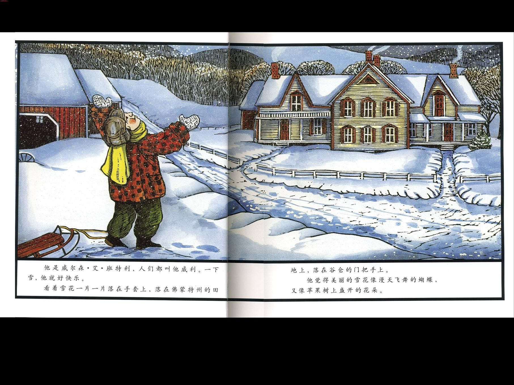

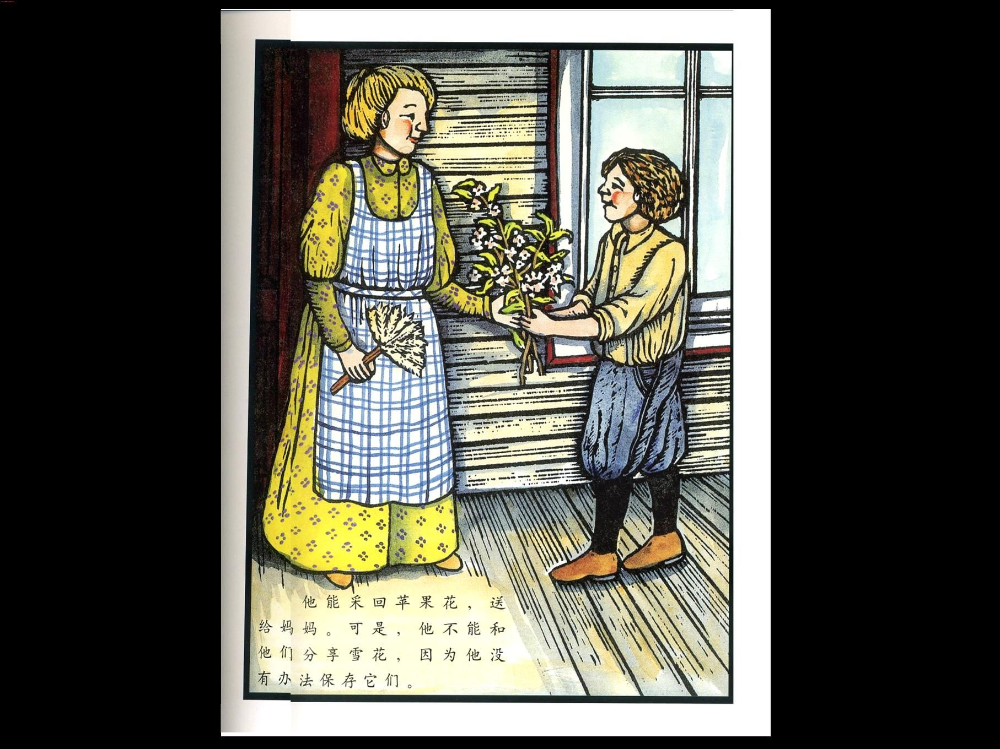

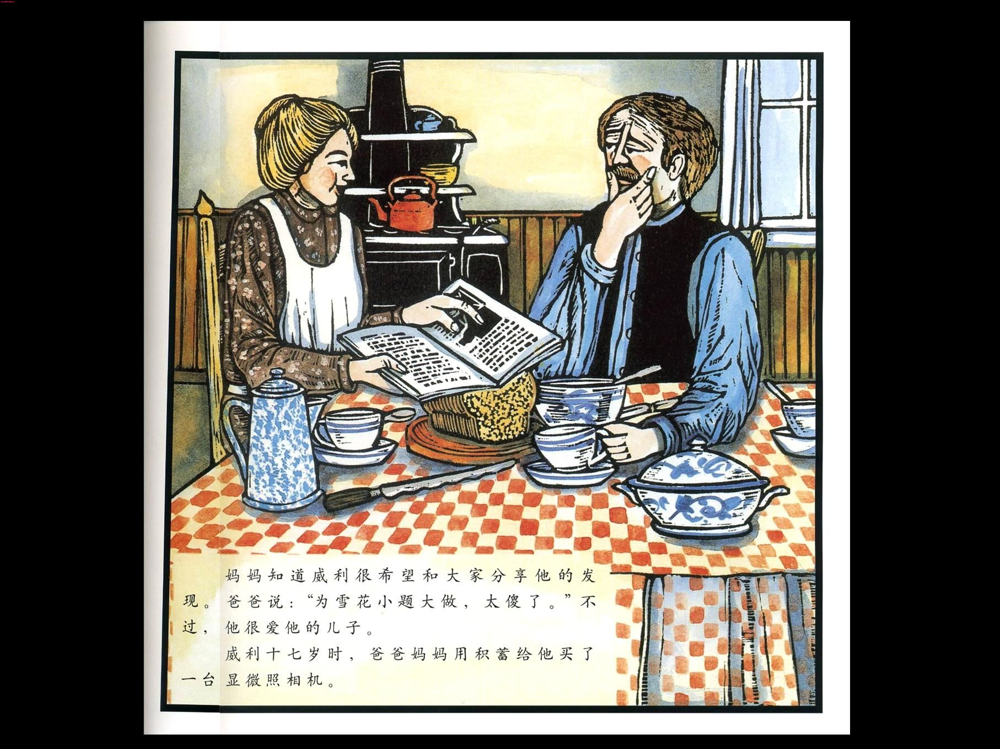

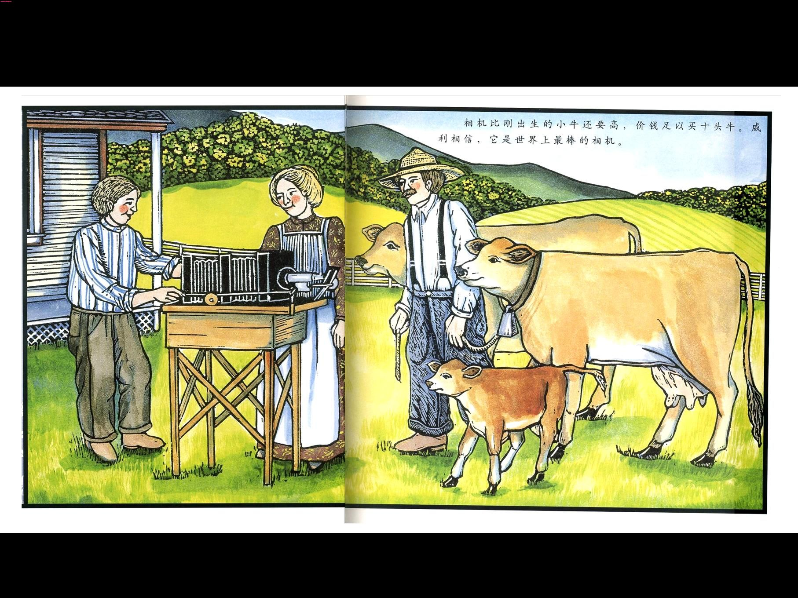

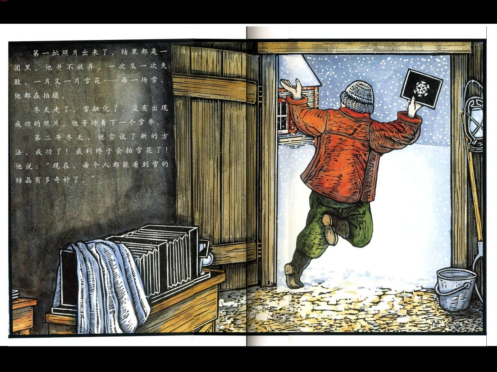

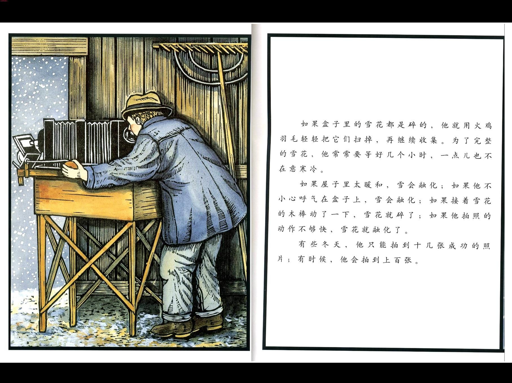

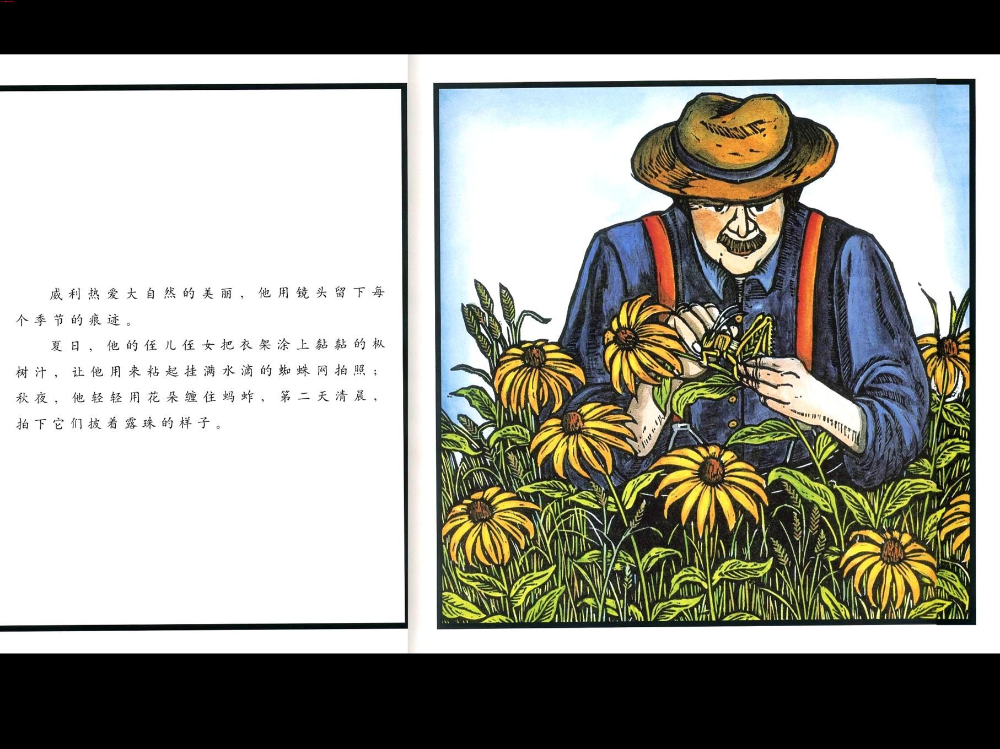

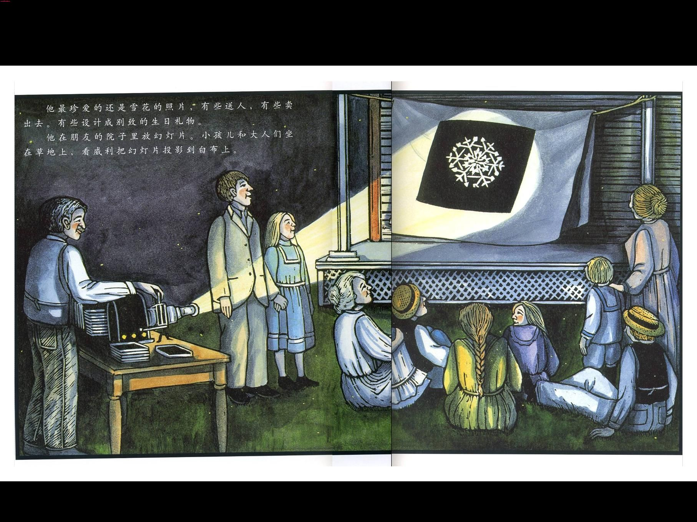

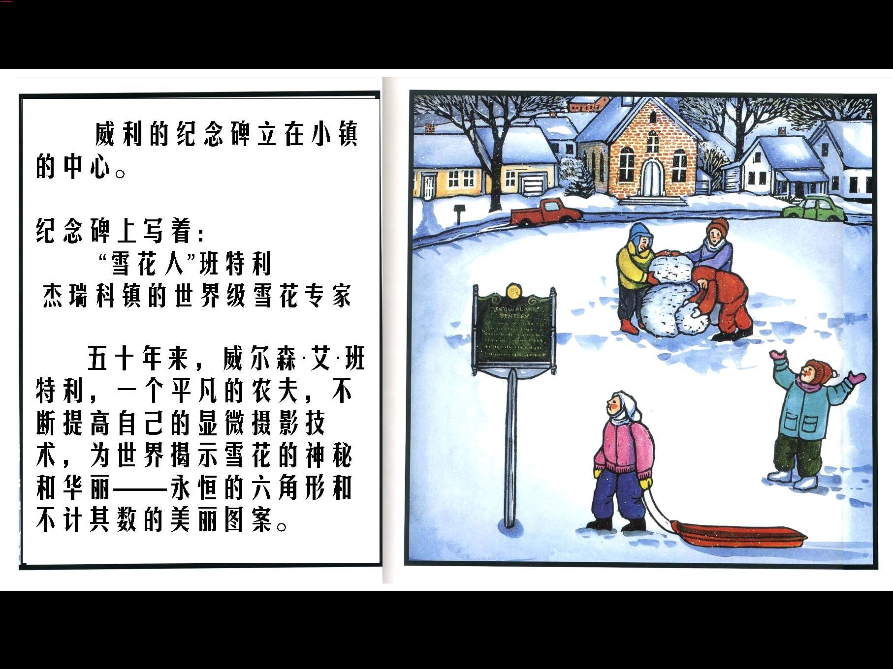

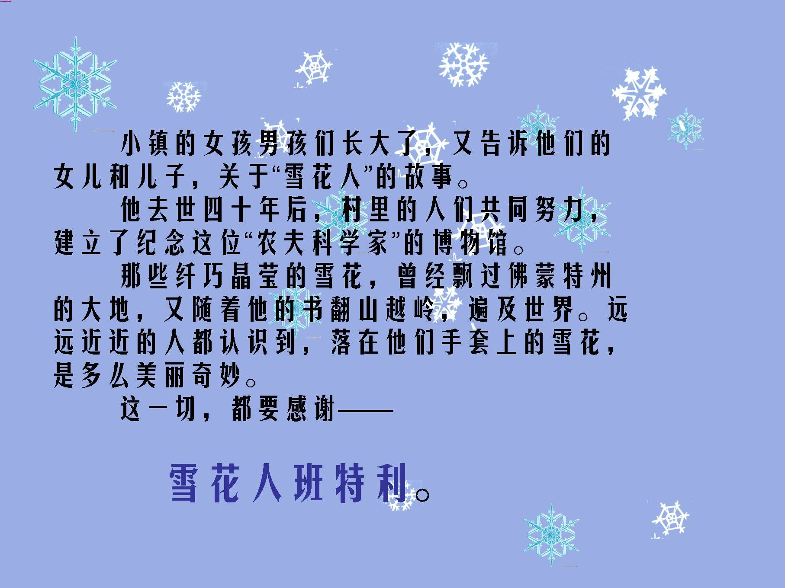

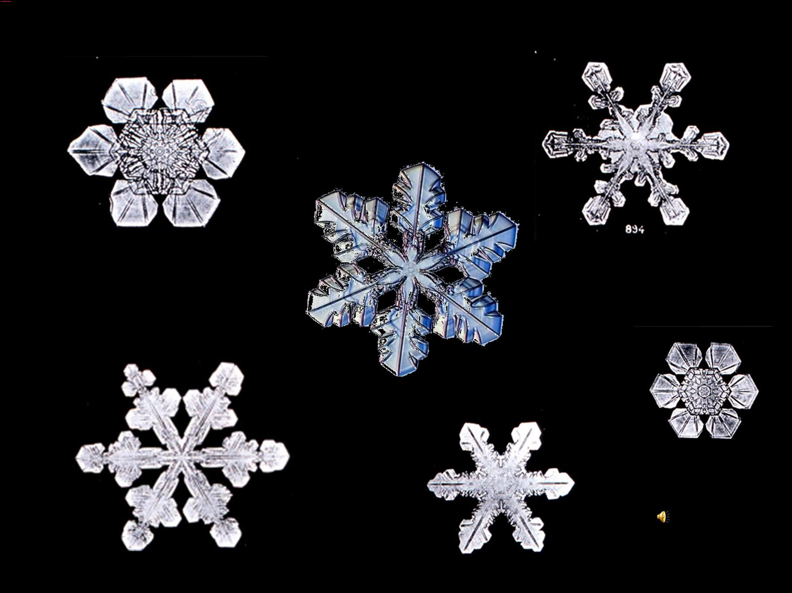
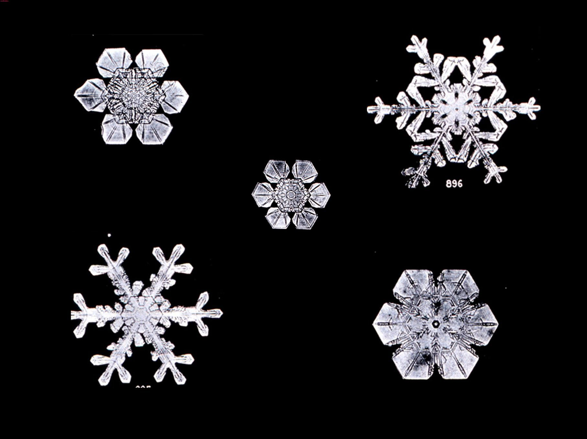

一般农场的农夫们，大都在天刚亮时起床，到牛群中工作。我也是在天刚亮时起床，却是因为想要发现挂着露珠的树叶，或被露水细致地装饰成珍珠项链般的蜘蛛网...
================================================================================

我带着相机，跪在湿湿的草地上，拍下大自然精致的点点滴滴。我这样做，可以帮助许多人看到他们自己无法看到的美丽事物，
================================================================================

他们每天还是有牛奶喝，其他农夫会保证一点。
================================================================================

不过，我想，我为他们做的，是同样重要的事情。
================================================================================

威尔森.艾.班特利
================================================================================

这是个真实的故事！
================================================================================

似曾我们有过，爱一样东西胜过爱世界上任何其它东西，孩子们完全同意我的说法，当然，也有一些孩子们会很茫然地看着我，其实这种感觉不用我去讲，孩子们通过一本又一本的图画书中慢慢去经历，播下爱的种子，一颗特别的“爱”。

接着我们一起与小威利一起分享：和哥哥仔细观察蝴蝶的快乐，把苹果花送给妈妈的愉悦，但是有谁知道他的心事呢？妈妈。他最爱的雪花，却不能和他们分享，因为他没有办法保存他们。

妈妈给他一台旧显微镜，可以观察花瓣、雨滴和叶片，最重要的是，还可以观察雪。当其穿孔机小孩玩堆城堡。扔雪球时，威利却在收集雪花。每个飘雪的日子，他都在研究雪的结晶。

通过故事与画面，让孩子们去感受，这就是热爱，热爱一样事物，用心去感受其中的快乐与成就感，这当中就会为它付出更多的时间和精力，这也就是为什么别的孩子可以玩堆城堡扔雪球，而威利却在玩他的研究。

通过下面的文字，让孩子们更深入地体验这种感觉：每片雪花都有复杂而精致的图案，美丽的程度远远超过威利的想像。他以为会出现相同的图案，结果却从来没有发现过。他立志把雪花保存下来，让大家都能看到这美妙的图案。连续三个冬天，他试着画出雪花的形状，可是，常常来不及画完，雪花就融化了。

不过毕竟是小学生，学生们参与讨论的时候，比如讲到这里的时候：威利十六岁时，听说了一种显微照相机。他告诉妈妈：“如果我有这种相机，就可以把雪花拍摄下来。”但是这种显微照相机太贵啦，价钱足以买十头牛呢。

孩子们其实也不知道十头牛的概念，只是表现出惊讶的神情。爸爸妈妈听了威利的话会不会给威利买这种相机呢？呵呵，这会儿学生可活跃了，不过不管说什么，都是根据他自己的经验来说的。而当我继续往下讲的时候，所有的孩子都羡慕得把眼睛瞪得大大的了：

妈妈知道威利很希望和大家分享他的发现。爸爸说：“为雪花小题大做，太傻了。”不过，他很爱他的儿子。威利十七岁时，爸爸妈妈用积蓄给他买了一台显微镜。相机比刚出生的小牛还要高，价钱足以买十头牛。威利相信，它是世界上最棒上相机。

第一批照片出来了，结果都是一团黑。他并不放弃。一次又一次失败，一片又一片雪花……每一场雪，他都在拍摄。冬天走了，雪融化了，没有出现成功的照片。他等待着下一个雪季。第二年冬天，他尝试了新的方法，成功了！威利终于会拍雪花了！他说：“现在，每个人都能看到雪的结晶有多奇妙了。”

可是，那时候，没有人理解威利。邻居们嘲笑他的想法和做法。他们说：“在这个地方，雪像土一样平常，谁稀罕照片。”威利却说，这些照片是他送给世界的礼物。

当别人围在火炉旁取暖，骑马或坐雪橇进城时，威利却都在研究雪。他捧着一个黑盒子站在门前，收集雪花。

如果盒子里的雪花都是碎的，他就用火鸡羽毛轻轻把它们扫掉，再继续收集。为了完整的雪花，他常常要等好几个小时，一点儿也不在意寒冷。

如果屋子里太暖和，雪会融化；如果他不小心呼气到盒子上，雪会融化，如果接着雪花的木棒动了一下，雪花就碎了；如果他拍照的动作不够快，雪花就融化了。

有些冬天，他只能拍到十几张成功的照片；有时候，他会拍到上百张。

威利热爱大自然的美丽，他用镜头留下每个季节的痕迹。

夏日，他的侄儿侄女把衣架涂上黏黏的枞树汁，让他用来粘起挂满水滴的蜘蛛网拍照；秋夜，他轻轻用花朵缠住蚂蚱，第二天清晨，拍下它们披着露珠的样子……

他最珍爱的还是雪花的照片，有些送人，有些卖出去。有些设计成别致的生日礼物。他在朋友的院子里放幻灯片。小孩儿和大人们坐在草地上，看威利把幻灯片投影到白布上。

他的书出版了不到一个月，在一场暴风雪中，为了拍更多的照片，他走了六英里路回家。 结果，他得了肺炎，两个星期去世了。

威利的纪念碑立在小镇的中心。

小镇的女孩男孩们长大了，又告诉他们的女儿和儿子，关于“雪花人”的故事。

他去世四十年后，村里的人们共同努力，建立了纪念这位“农夫科学家”的博物馆。

那些纤巧晶莹的雪花，曾经飘过佛蒙特州的大地，又随着他的书翻山越岭，遍及世界。

远远近近的人都认识到，落在他们手套上的雪花，是多么美丽奇妙。

这一切，都要感谢 --
雪花人班特利

